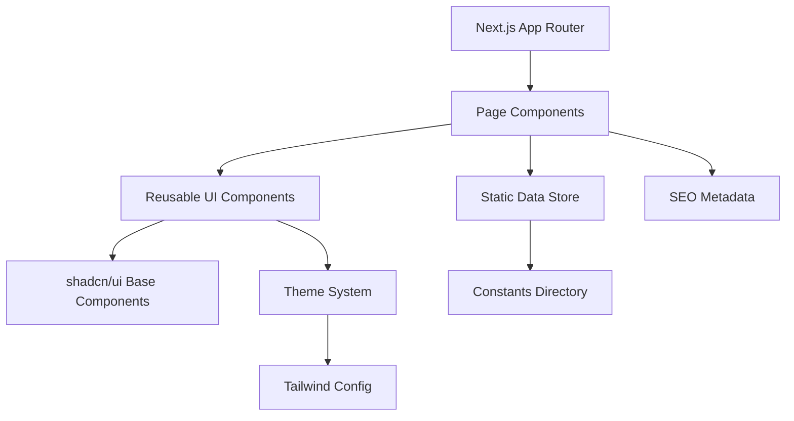

# Design Document

## Overview

TheAbhiPatel Portfolio is a modern, server-side rendered portfolio website built with Next.js 14+ (App Router), TypeScript, Tailwind CSS, and shadcn/ui. The application follows a component-based architecture with static data management, optimized for performance through Static Site Generation (SSG) and Next.js Image optimization.

The design emphasizes a dark-mode-first approach with blue and indigo gradients, futuristic typography, and subtle animations. All portfolio data is stored in a centralized constants directory, allowing for easy future migration to a backend API.

## Architecture

### High-Level Architecture



### Directory Structure

```
/src
├── app/
│   ├── layout.tsx              # Root layout with theme provider
│   ├── page.tsx                # Home page
│   ├── skills/
│   │   └── page.tsx            # Skills page
│   ├── projects/
│   │   ├── page.tsx            # Projects listing
│   │   └── [slug]/
│   │       └── page.tsx        # Individual project detail
│   ├── experience/
│   │   └── page.tsx            # Experience page
│   ├── about/
│   │   └── page.tsx            # About page
│   └── contact/
│       └── page.tsx            # Contact page
├── components/
│   ├── ui/                     # shadcn/ui components
│   ├── layout/
│   │   ├── Navbar.tsx
│   │   └── Footer.tsx
│   ├── home/
│   │   ├── HeroSection.tsx
│   │   ├── SkillsPreview.tsx
│   │   ├── ProjectsPreview.tsx
│   │   └── ExperiencePreview.tsx
│   ├── skills/
│   │   └── SkillCard.tsx
│   ├── projects/
│   │   └── ProjectCard.tsx
│   ├── experience/
│   │   └── ExperienceTimeline.tsx
│   ├── contact/
│   │   └── ContactForm.tsx
│   └── shared/
│       ├── AnimatedBackground.tsx
│       └── SectionHeading.tsx
├── constants/
│   ├── skills.ts
│   ├── projects.ts
│   ├── experience.ts
│   ├── about.ts
│   └── contact.ts
├── hooks/
│   └── useFormValidation.ts
├── utils/
│   ├── validation.ts
│   └── seo.ts
├── styles/
│   └── globals.css
└── lib/
    └── utils.ts                # shadcn/ui utility functions
```

### Technology Stack

- **Framework**: Next.js 14+ (App Router) with TypeScript
- **Styling**: Tailwind CSS v3+
- **UI Components**: shadcn/ui with custom theme
- **Animations**: Framer Motion for React animations
- **SVG Animations**: Custom SVG components or react-lottie
- **Code Quality**: ESLint, Prettier, Husky, lint-staged
- **Deployment**: Vercel or similar platform supporting Next.js

## Components and Interfaces

### Core Layout Components

#### Navbar Component
```typescript
interface NavbarProps {
  className?: string;
}

interface NavLink {
  label: string;
  href: string;
}

// Displays brand name "TheAbhiPatel" and navigation links
// Sticky positioning with backdrop blur effect
```

#### Footer Component
```typescript
interface FooterProps {
  className?: string;
}

// Displays brand name, social links, and copyright
// Consistent styling with theme
```

### Home Page Components

#### HeroSection Component
```typescript
interface HeroSectionProps {
  name: string;
  title: string;
  tagline: string;
  ctaText: string;
  ctaLink: string;
}

// Animated entrance with gradient text
// CTA button with hover effects
```

#### SkillsPreview Component
```typescript
interface Skill {
  name: string;
  icon: string | React.ReactNode;
  category: 'frontend' | 'backend' | 'devops' | 'tools';
}

interface SkillsPreviewProps {
  skills: Skill[];
  maxDisplay?: number;
}

// Grid layout of skill icons
// Link to full skills page
```

#### ProjectsPreview Component
```typescript
interface ProjectPreview {
  id: string;
  title: string;
  description: string;
  technologies: string[];
  image: string;
  githubUrl?: string;
  liveUrl?: string;
}

interface ProjectsPreviewProps {
  projects: ProjectPreview[];
  maxDisplay?: number;
}

// Featured projects with "View More" button
// Card-based layout with hover effects
```

#### ExperiencePreview Component
```typescript
interface ExperienceEntry {
  id: string;
  company: string;
  role: string;
  duration: string;
  startDate: Date;
  endDate?: Date;
  achievements: string[];
}

interface ExperiencePreviewProps {
  experiences: ExperienceEntry[];
  maxDisplay?: number;
}

// Mini timeline view
// Reverse chronological order
```

### Skills Page Components

#### SkillCard Component
```typescript
interface SkillCardProps {
  name: string;
  icon: string | React.ReactNode;
  category: string;
  proficiency?: 'beginner' | 'intermediate' | 'advanced' | 'expert';
  description?: string;
}

// Visual card with icon, name, and optional proficiency indicator
// Hover animation with scale and glow effect
```

### Projects Page Components

#### ProjectCard Component
```typescript
interface ProjectCardProps {
  project: {
    id: string;
    slug: string;
    title: string;
    description: string;
    technologies: string[];
    image: string;
    githubUrl?: string;
    liveUrl?: string;
  };
}

// Clickable card navigating to project detail page
// Displays preview image, title, description, tech stack
// External links for GitHub and live demo
```

#### ProjectDetail Component
```typescript
interface ProjectDetailProps {
  project: {
    slug: string;
    title: string;
    overview: string;
    features: string[];
    architecture: string;
    technologies: string[];
    images: string[];
    githubUrl?: string;
    liveUrl?: string;
  };
}

// Full project information page
// Image gallery, feature list, technical breakdown
```

### Experience Page Components

#### ExperienceTimeline Component
```typescript
interface ExperienceTimelineProps {
  experiences: ExperienceEntry[];
}

// Vertical timeline with company logos
// Expandable sections for achievements
// Reverse chronological order
```

### Contact Page Components

#### ContactForm Component
```typescript
interface ContactFormProps {
  onSubmit: (data: ContactFormData) => void;
}

interface ContactFormData {
  name: string;
  email: string;
  message: string;
}

// Form with validation
// Success/error states
// Social media links section
```

### Shared Components

#### AnimatedBackground Component
```typescript
interface AnimatedBackgroundProps {
  variant: 'hero' | 'section' | 'page';
  theme?: 'blue' | 'indigo' | 'gradient';
}

// SVG-based animated backgrounds
// Subtle, non-distracting animations
// Performance-optimized with CSS transforms
```

#### SectionHeading Component
```typescript
interface SectionHeadingProps {
  title: string;
  subtitle?: string;
  align?: 'left' | 'center' | 'right';
}

// Consistent heading styles across pages
// Optional gradient text effect
```

## Data Models

### Skill Model
```typescript
interface Skill {
  id: string;
  name: string;
  icon: string;
  category: 'mern' | 'fullstack' | 'javascript' | 'devops';
  subcategory?: string;
  proficiency?: 'beginner' | 'intermediate' | 'advanced' | 'expert';
  description?: string;
}

interface SkillCategory {
  name: string;
  skills: Skill[];
}
```

### Project Model
```typescript
interface Project {
  id: string;
  slug: string;
  title: string;
  shortDescription: string;
  overview: string;
  features: string[];
  architecture?: string;
  technologies: string[];
  images: string[];
  thumbnailImage: string;
  githubUrl?: string;
  liveUrl?: string;
  featured: boolean;
  createdAt: Date;
}
```

### Experience Model
```typescript
interface Experience {
  id: string;
  company: string;
  companyLogo?: string;
  role: string;
  duration: string;
  startDate: Date;
  endDate?: Date;
  current: boolean;
  achievements: string[];
  technologies?: string[];
}
```

### About Model
```typescript
interface AboutData {
  introduction: string;
  background: string[];
  interests: string[];
  profileImage?: string;
}
```

### Contact Model
```typescript
interface ContactInfo {
  email: string;
  socialLinks: SocialLink[];
}

interface SocialLink {
  platform: string;
  url: string;
  icon: string;
}
```

### SEO Metadata Model
```typescript
interface SEOMetadata {
  title: string;
  description: string;
  keywords: string[];
  ogImage?: string;
  ogType?: string;
  twitterCard?: string;
}
```

## Correctness Properties

*A property is a characteristic or behavior that should hold true across all valid executions of a system—essentially, a formal statement about what the system should do. Properties serve as the bridge between human-readable specifications and machine-verifiable correctness guarantees.*


### Property Reflection

After analyzing all acceptance criteria, several properties were identified as redundant or could be combined:

- Skills display criteria (4.1-4.4) all test specific skill presence - combined into a single data completeness property
- Theme configuration properties (1.2, 1.5) overlap - 1.5 is more comprehensive
- Project card rendering (5.1, 5.2) - 5.2 subsumes 5.1 by testing both rendering and content
- Image optimization (11.1, 11.2) - combined into single optimization property

### Testable Properties

Property 1: Theme configuration centralization
*For any* theme value (color, font, spacing), the value should be defined in the centralized theme configuration file and referenced by components rather than hardcoded
**Validates: Requirements 1.5**

Property 2: Navigation functionality
*For any* navigation link in the Navigation Component, clicking the link should navigate to the corresponding page route
**Validates: Requirements 2.2**

Property 3: Footer brand consistency
*For any* page in the Portfolio System, the rendered page should include a footer containing the brand name "TheAbhiPatel"
**Validates: Requirements 2.4**

Property 4: Skills categorization
*For any* skill in the data store, the skill should be assigned to a logical category and rendered within a Skill Card component
**Validates: Requirements 4.5**

Property 5: Project card completeness
*For any* project in the data store, the rendered Project Card should display title, short description, technologies array, and links (GitHub and live URLs when available)
**Validates: Requirements 5.1, 5.2**

Property 6: Project card navigation
*For any* Project Card, clicking the card should navigate to the detailed project page with the correct slug
**Validates: Requirements 5.3**

Property 7: Project detail completeness
*For any* project detail page, the page should display project overview, features list, and architecture/technical breakdown sections
**Validates: Requirements 5.4**

Property 8: Experience entry completeness
*For any* experience entry in the data store, the rendered entry should display company name, role, duration, and achievements list
**Validates: Requirements 6.2**

Property 9: Experience chronological ordering
*For any* set of experience entries, the rendered list should be ordered in reverse chronological order (most recent first) based on start date
**Validates: Requirements 6.3**

Property 10: Contact form validation
*For any* contact form submission with missing required fields (name, email, or message), the form should display validation errors and prevent submission
**Validates: Requirements 8.3**

Property 11: Image optimization
*For any* image rendered in the Portfolio System, the image should use the Next.js Image component with appropriate lazy loading configuration
**Validates: Requirements 11.1, 11.2**

Property 12: SEO metadata presence
*For any* page in the Portfolio System, the page should include SEO metadata (title, description) and OpenGraph tags in the HTML head
**Validates: Requirements 11.4**

## Error Handling

### Form Validation Errors
- Contact form validates required fields (name, email, message)
- Email field validates proper email format
- Display inline error messages for invalid fields
- Prevent form submission until all validations pass

### Navigation Errors
- Handle 404 errors for invalid project slugs
- Redirect to home page or show custom 404 page
- Graceful fallback for missing images (placeholder image)

### Data Loading Errors
- Handle missing or malformed data in constants
- Provide default values for optional fields
- Log errors to console in development mode

### Performance Errors
- Implement error boundaries for React component errors
- Graceful degradation if animations fail to load
- Fallback for unsupported browsers

## Testing Strategy

### Unit Testing

The Portfolio System will use **Vitest** as the unit testing framework, chosen for its speed, native ESM support, and excellent TypeScript integration.

Unit tests will cover:

- **Component Rendering**: Verify that components render with correct props and display expected content
- **Form Validation Logic**: Test validation functions for contact form (email format, required fields)
- **Data Transformation**: Test utility functions that process or format data from constants
- **Navigation Logic**: Test that navigation links generate correct hrefs
- **SEO Utilities**: Test metadata generation functions

Example test areas:
- ContactForm component validates email format correctly
- ExperienceTimeline sorts entries by date
- Project slug generation from titles
- Theme configuration exports expected values

### Property-Based Testing

The Portfolio System will use **fast-check** as the property-based testing library for JavaScript/TypeScript.

Property-based testing configuration:
- Each property test should run a minimum of 100 iterations
- Each test must be tagged with a comment referencing the correctness property from this design document
- Tag format: `// Feature: portfolio-website, Property {number}: {property_text}`
- Each correctness property must be implemented by a SINGLE property-based test

Property tests will verify:

1. **Theme Configuration Centralization** (Property 1): Generate random theme value requests and verify all values come from the centralized config
2. **Navigation Functionality** (Property 2): Generate random navigation link selections and verify correct route navigation
3. **Footer Brand Consistency** (Property 3): Generate random page routes and verify footer contains brand name
4. **Skills Categorization** (Property 4): Generate random skill data and verify each skill has a category and renders in a card
5. **Project Card Completeness** (Property 5): Generate random project data and verify all required fields are displayed
6. **Project Card Navigation** (Property 6): Generate random project cards and verify clicking navigates to correct detail page
7. **Project Detail Completeness** (Property 7): Generate random project detail data and verify all sections are present
8. **Experience Entry Completeness** (Property 8): Generate random experience data and verify all required fields are displayed
9. **Experience Chronological Ordering** (Property 9): Generate random experience arrays and verify reverse chronological sorting
10. **Contact Form Validation** (Property 10): Generate random form data with missing fields and verify validation errors
11. **Image Optimization** (Property 11): Generate random image references and verify Next.js Image component usage
12. **SEO Metadata Presence** (Property 12): Generate random page routes and verify SEO metadata in head

### Integration Testing

Integration tests will verify:
- Page-to-page navigation flows
- Data flow from constants to rendered components
- Theme application across all components
- Form submission flow (validation → display)

### Testing Best Practices

- Tests should not use mocks for core logic - test real functionality
- Co-locate test files with source files using `.test.ts` or `.test.tsx` suffix
- Use descriptive test names that explain what is being tested
- Focus on testing behavior, not implementation details
- Property tests should use smart generators that constrain to valid input space

## Performance Considerations

### Image Optimization
- Use Next.js Image component with automatic optimization
- Implement lazy loading for below-the-fold images
- Use appropriate image formats (WebP with fallbacks)
- Define explicit width and height to prevent layout shift

### Code Splitting
- Leverage Next.js automatic code splitting per route
- Dynamic imports for heavy components (animations, Lottie)
- Lazy load non-critical components

### Static Generation
- Use Static Site Generation (SSG) for all pages
- Pre-render all project detail pages at build time
- Generate static paths for dynamic routes

### Animation Performance
- Use CSS transforms and opacity for animations (GPU-accelerated)
- Implement `will-change` CSS property sparingly
- Use `requestAnimationFrame` for JavaScript animations
- Provide reduced motion support via `prefers-reduced-motion`

### Bundle Size
- Tree-shake unused shadcn/ui components
- Minimize third-party dependencies
- Use dynamic imports for large libraries
- Monitor bundle size with Next.js bundle analyzer

## Deployment Strategy

### Build Process
1. Run ESLint and Prettier checks
2. Run type checking with TypeScript
3. Run unit and property-based tests
4. Build Next.js application with `next build`
5. Generate static export if needed

### Environment Configuration
- Use environment variables for deployment-specific config
- Separate development and production configurations
- Configure custom domain (theabhipatel.com)

### Hosting
- Deploy to Vercel (recommended for Next.js)
- Configure automatic deployments from main branch
- Set up preview deployments for pull requests
- Configure custom domain with SSL

### Monitoring
- Set up error tracking (Sentry or similar)
- Monitor Core Web Vitals
- Track page load performance
- Monitor build times and bundle sizes

## Future Enhancements

### Backend Integration
The current design uses static data in `/constants/` directory. The data structure is designed to allow easy migration to a backend API:

```typescript
// Current: Import from constants
import { projects } from '@/constants/projects';

// Future: Fetch from API
const projects = await fetch('/api/projects').then(r => r.json());
```

Data models are already defined with proper TypeScript interfaces, making API integration straightforward.

### Content Management
- Potential integration with headless CMS (Contentful, Sanity)
- Admin panel for updating portfolio content
- Dynamic content updates without redeployment

### Analytics
- Add Google Analytics or privacy-focused alternative
- Track page views and user interactions
- Monitor popular projects and skills

### Contact Form Backend
- Integrate with email service (SendGrid, Resend)
- Add form submission to database
- Implement spam protection (reCAPTCHA)

### Internationalization
- Add multi-language support
- Translate content to additional languages
- Locale-based routing
